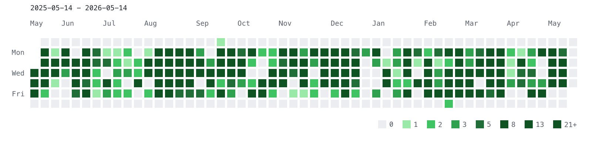
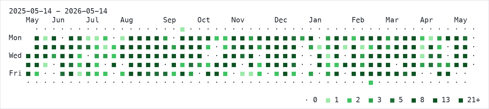

# hitmap


Render GitHub-style git contribution heatmaps directly in your terminal.

`hitmap` is a Rust CLI for exploring commit activity in any git repository. It can render
inline images via the Kitty Graphics Protocol, fall back to a portable Unicode text view,
and export PNGs for sharing or documentation.

## Preview

### Kitty renderer



### Text renderer



## Features

- **GitHub-style heatmaps in the terminal**
- **Two renderers**: Kitty inline graphics and portable Unicode text
- **PNG export** for screenshots, docs, and sharing
- **Flexible time windows** with rolling ranges (`--last 90d`) or exact dates (`--from` / `--to`)
- **Author filtering** by exact name or email, with an `authors` command to inspect identities
- **Curated color profiles** including GitHub, Aurora, Ocean, Fire, and Catppuccin variants
- **Custom intensity scales** with linear or Fibonacci-style threshold profiles
- **Persistent defaults** via an XDG config file and `hitmap config` subcommands
- **Terminal diagnostics** via `hitmap doctor`
- **Sensible defaults**: `hitmap` with no subcommand renders the current repository

## Installation

### Build from source

After cloning the repository:

```bash
cargo install --path .
```

Or build a release binary manually:

```bash
cargo build --release
./target/release/hitmap --help
```

### Requirements

- `git` available on your `PATH`
- A recent Rust toolchain with Cargo
- For inline image rendering: a terminal that supports the
  [Kitty Graphics Protocol](https://sw.kovidgoyal.net/kitty/graphics-protocol/)
  such as Kitty or Ghostty
- For portable output: any reasonably Unicode-capable terminal with `--renderer text`

## Quick start

```bash
# Render the current repository
hitmap

# Render another repository
hitmap ~/code/my-repo

# Render the last 90 days
hitmap --last 90d

# Filter to a single author
hitmap --author-name "Jane Doe"

# Use the text renderer
hitmap render --renderer text

# Save a PNG instead of rendering inline
hitmap render --output hitmap.png

# Persist your preferred defaults
hitmap config set render.theme dark
hitmap config set render.color_profile ocean
```

## Configuration

hitmap supports a per-user TOML config file at:

- `$XDG_CONFIG_HOME/hitmap/hitmap.toml`
- fallback: `~/.config/hitmap/hitmap.toml`

Precedence order:

1. CLI flags
2. Config file values
3. Built-in defaults

Useful commands:

```bash
hitmap config path
hitmap config init
hitmap config show
hitmap config show --effective
hitmap config edit
hitmap config set render.theme dark
hitmap config set render.color_profile ocean
hitmap config unset render.max_width_cells
```

Supported config keys:

- `render.renderer`
- `render.theme`
- `render.color_profile`
- `render.scale_profile`
- `render.scale_multiplier`
- `render.render_scale`
- `render.max_width_cells`
- `authors.output_format`
- `doctor.output_format`

`hitmap config init` creates a commented starter config with documented options.
`hitmap config show --effective` prints the merged configuration after applying built-in defaults.
`hitmap config edit` opens the config file in `$VISUAL`, `$EDITOR`, or `vi`, creating the commented template first when needed.

Example config:

```toml
[render]
theme = "dark"
color_profile = "ocean"
scale_profile = "fibonacci-21-plus"
scale_multiplier = 1
render_scale = 2.0

[authors]
output_format = "table"

[doctor]
output_format = "table"
```

## Commands

| Command | Description |
| --- | --- |
| `hitmap [REPO_PATH]` | Shortcut for `hitmap render [REPO_PATH]` |
| `hitmap render [REPO_PATH]` | Render a commit heatmap |
| `hitmap authors [REPO_PATH]` | List author identities reachable from the current `HEAD` history |
| `hitmap doctor` | Check terminal support and rendering prerequisites |
| `hitmap config` | Inspect and update persisted defaults |

## Usage examples

### Render commit activity

```bash
# Default: current repo, last 1 year, all authors
hitmap

# Exact date range
hitmap render --from 2025-01-01 --to 2025-12-31

# Last 12 weeks in a dark theme
hitmap render --last 12w --theme dark

# Use a different color profile
hitmap render --color-profile ocean

# Tune the activity scale
hitmap render --scale-profile linear-10-plus --scale-multiplier 2

# Limit render width in terminal cells
hitmap render --max-width-cells 90
```

### Work with authors

```bash
# List authors grouped by name
hitmap authors --group-by name

# Search identities and limit results
hitmap authors --search jane --limit 10

# Export author data as JSON
hitmap authors --group-by email --format json
```

### Diagnose terminal support

```bash
# Human-readable diagnostics
hitmap doctor

# Machine-readable diagnostics
hitmap doctor --format json
```

## Rendering modes

### Kitty renderer

The default renderer produces an inline PNG and displays it directly in the terminal using the
Kitty Graphics Protocol.

Use this when you want the highest fidelity output:

```bash
hitmap render
```

### Text renderer

The text renderer works in terminals that do not support Kitty graphics and is especially useful
for SSH sessions, remote environments, and simple logging.

```bash
hitmap render --renderer text
```

### PNG export

You can also save the image to disk instead of displaying it inline:

```bash
hitmap render --output hitmap.png
```


## Customization

### Time window options

- `--last 90d`, `--last 12w`, `--last 6m`, `--last 1y`
- `--from YYYY-MM-DD`
- `--to YYYY-MM-DD`

### Author selection

- `--all-authors`
- `--author-name NAME`
- `--author-email EMAIL`

Author matching is exact and case-insensitive. If no author filter is provided, `hitmap`
defaults to all authors.

### Color profiles

Available profiles:

- `github`
- `aurora`
- `ocean`
- `fire`
- `catppuccin-latte`
- `catppuccin-frappe`
- `catppuccin-macchiato`
- `catppuccin-mocha`

### Scale profiles

Scale profiles control how per-day commit counts map to color intensity.

Examples:

- `linear-5-plus`
- `linear-10-plus`
- `fibonacci-8-plus`
- `fibonacci-21-plus`

You can further adjust thresholds with `--scale-multiplier`.

## Troubleshooting

If inline image rendering does not work, run:

```bash
hitmap doctor
```

Common fixes:

- Use a Kitty-compatible terminal for inline image output
- Switch to the text renderer with `--renderer text`
- Export a PNG with `--output hitmap.png`
- Check terminal width if a render fails in text mode

## Development

```bash
cargo fmt
cargo test
cargo run -- --help
cargo run -- render --output /tmp/hitmap.png
```

## Contributing

Issues and pull requests are welcome.

If you plan to contribute code, please:

1. Open an issue for bugs, regressions, or feature proposals
2. Keep changes focused and well-scoped
3. Run formatting and tests before submitting

## License

MIT.
